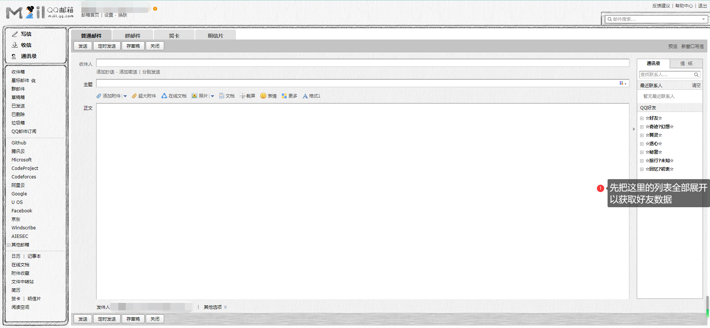
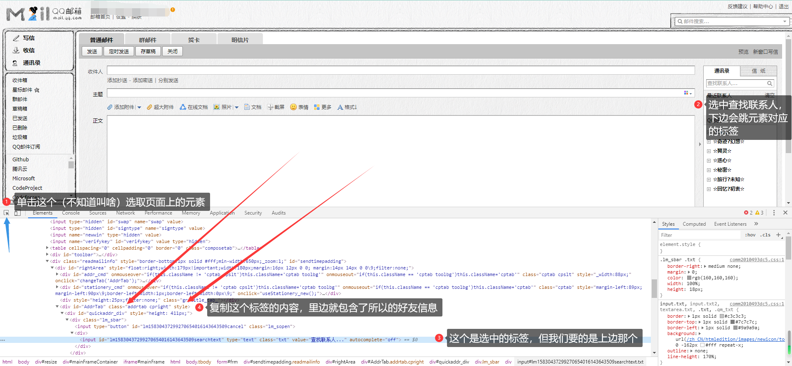

# 查找QQ共同好友

先说两句废话，今天和小伙伴在看空间的小秘密，惊讶的发现有个共同的小秘密，就想把他找出来hhh，然后就有了这一步

## 1. 获取数据

先打开网页版的QQ邮箱，并且进入写信界面，然后！！！**把右侧好友列表全部展开一遍（否则不会获取好友数据）**



然后就可以开始获取数据了

①先按下强大的F12，接着选取页面的元素（快捷键Ctrl+Shift+C）

②选中右侧好友列表上方的**查找联系人**，会跳转到对应的div标签，但我们要的数据在他的上上上级标签里边，就是这个标签↓↓↓

` <div id="AddrTab" class="addrtab cpright" style="">`



③复制这个标签的内容，里边就包含了我们所有的好友数据，随便存到一个txt文件里边就好，接下来用。

这里也给出好友数据所在标签的Xpath路径，会用的小伙伴可以直接用

`/html/body/form[2]/div[2]/div[1]/div[4]`

## 2. 数据清洗

这里的清洗很简单，就是把QQ号和备注提取出来存到excel里边，等朋友的excel也准备好了，两个文档查重就找到了共同好友。话不多说直接上代码

``` python
import re
import xlwt

file_name = "QQ好友.txt"

f = open(file_name, encoding="UTF-8")
text = f.read()

# 将数据分行，不然看着难受
split_text = text.split("</div>")

# 新建excel文档用于保存
data = xlwt.Workbook(encoding='UTF-8')
sheet = data.add_sheet("qq好友")

# 匹配每一个人
pattern = r'title=".*?" class="lm_addr">.*?</a>'
compile_re = re.compile(pattern)

# 匹配QQ号用
qq_pattern = r'title=".*?@qq.com"'
qq_re = re.compile(qq_pattern)

# 匹配姓名用
name_pattern = r'"lm_addr">.*?</a>'
name_re = re.compile(name_pattern)

row = 0   # 记录写到第几行了

# 匹配所有符合正则表达式的内容
for i in split_text:
    name_list = compile_re.findall(i)
    if len(name_list) == 1:     # 仅匹配到一个姓名
        qq = qq_re.findall(name_list[0])
        name = name_re.findall(name_list[0])
        if len(qq) == 1:
            print(qq[0][7:-8] + " " + name[0][10:-4])
            sheet.write(row, 0, str(qq[0][7:-8]))
            sheet.write(row, 1, str(name[0][10:-4]))
            row = row + 1
# 保存excel文档，这里保存为xlsx出错，还不知道为啥，应该是不支持，懒得去查了
data.save(file_name + ".xls")
```

然后保存的excel是下边这种样式的：

|QQ|备注|
|--|--|
|123456789|卖女孩的小火柴|
|12345678|容嬷嬷当年也是一枝花|
|1234567|加肥猫|
|123456|我叫抄级学霸|
|12345|老阿姨|

到这里自己的好友列表就提取完毕了（可以做个备份hhh）。现在就只差朋友的列表了

## 3. 查找共同好友

这时候好友的excel也已经发给你了，虽然查重用excel就可以完成，但我还是选择用python装个X

还是直接上代码

``` python
import xlrd

filename_1 = "我的好友.xls"     # 我的好友excel
filename_2 = "朋友的好友xls"     # 朋友的好友excel

data_1 = xlrd.open_workbook(filename_1)     # 我的
data_2 = xlrd.open_workbook(filename_2)     # 朋友的
table_1 = data_1.sheet_by_index(0)          # 我的
table_2 = data_2.sheet_by_index(0)          # 朋友的

# 我的好友：获取有多少行，然后逐行转换成json数据
rows_1 = table_1.nrows
list_1 = {}
for i in range(0, rows_1):
    qq_id = table_1.row(i)[0].value
    qq_name = table_1.row(i)[1].value
    list_1[qq_id] = qq_name

# 朋友的好友：获取有多少行，然后逐行转换成json数据
rows_2 = table_2.nrows
list_2 = {}
for i in range(0, rows_2):
    qq_id = table_2.row(i)[0].value
    qq_name = table_2.row(i)[1].value
    list_2[qq_id] = qq_name

# 开始查重
keys_2 = list_2.keys()
for key in list_1.keys():
    if key in keys_2:
        print(key)
        print(list_1[key])
        print(list_2[key])
```

这里是直接输出，没有再去保存

然后，就是接着开篇的废话了，我和朋友的共同好友结果很出乎意料，，，，总共输出了两个QQ号：一个是我的，另一个是朋友的。查了一下说QQ会把自己也算在好友列表中，就像是自己加了自己，所以才会出现“你们有1个共同好友”。但是这个空间的小秘密是谁发的就很奇怪了（确定不是我俩发的），就随缘吧

这就是我的办法了，喜欢的朋友不妨仔细看一看，如果有改进的地方，热烈欢迎！
